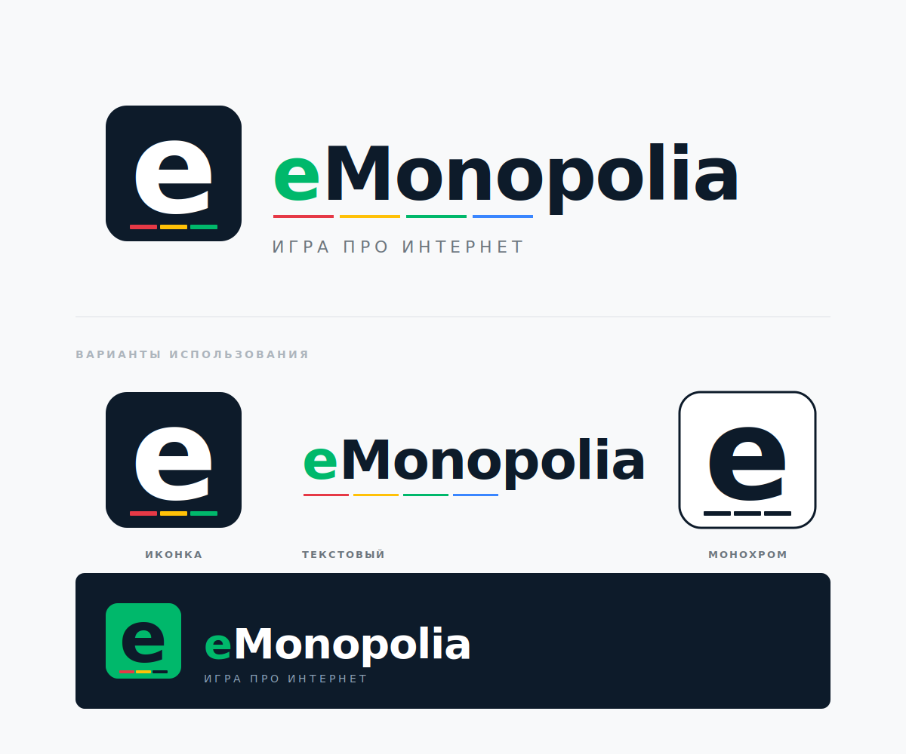

<div align="center">
  

  <h3>Гибридная настольно-цифровая игра, которая объясняет, как устроен интернет.</h3>

  <p>
    <a href="./ROADMAP.md">Roadmap</a> ·
    <a href="./docs/design.md">Концепция</a> ·
    <a href="./docs/mechanics.md">Механика</a> ·
    <a href="./docs/cards.md">Карточки</a>
  </p>
</div>

---

## О чём

Классическая Монополия переосмыслена в мире цифровой экономики. Игроки — интернет-предприниматели, которые строят свои поисковики, соцсети и маркетплейсы. Покупают хостинг, отбиваются от DDoS-атак, торгуют трафиком, попадают под бан. Через знакомую игровую механику игроки изучают, кто такие провайдеры, чем зарабатывает Google, и почему YouTube стоит дороже всего на доске.

## Что это

**eMonopolia** — это:
- 📋 **Настольная игра** (40 клеток, как в классике) с печатными материалами
- 📱 **Веб-приложение** для расчётов, карточек и трафика
- 🎓 **Образовательный инструмент** — каждое поле раскрывает реальную бизнес-модель сервиса
- 🪙 **Симулятор крипты** — все сделки подтверждаются игроками, как в блокчейне

## Особенности

- **Двойная прокачка** — хостинг (VPS → датацентр) и контент (Tilda → собственная разработка) развиваются независимо
- **Трафик как ресурс** — поисковики генерируют, маркетплейсы конвертируют, экосистемы дают синергию
- **Эмулированная крипта** — все подтверждают сделку, как в реальной децентрализованной сети
- **Три редакции** — национальная, международная, смешанная

## Статус

🚧 **На стадии дизайна.** Игровая механика и контент проработаны, разработка ведётся.

См. [ROADMAP.md](./ROADMAP.md) для фаз разработки.

## Структура репозитория

```
branding/    — логотип, цвета, шрифты
docs/        — дизайн-документы (концепция, механика, лор)
data/        — единый источник данных (YAML): карточки, поля, события
apps/        — приложения (web, tma, api)
print/       — материалы для печати (поле, карточки, правила)
content/     — обучающие материалы (i18n)
```

## Лицензии

- **Код** — [MIT](./LICENSE-CODE)
- **Игровой дизайн, контент, печатные материалы, логотип** — [CC BY-SA 4.0](./LICENSE-CONTENT)

## Контакты

Автор: [@iMironRU](https://github.com/iMironRU)

---

<div align="center">
  <em>"Покажи, как работает интернет — и они никогда не забудут."</em>
</div>
